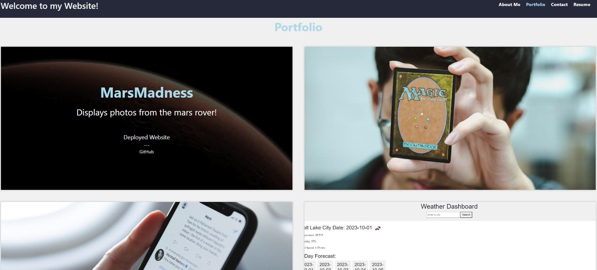
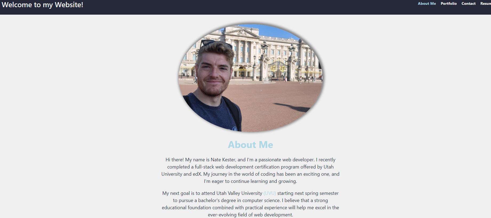
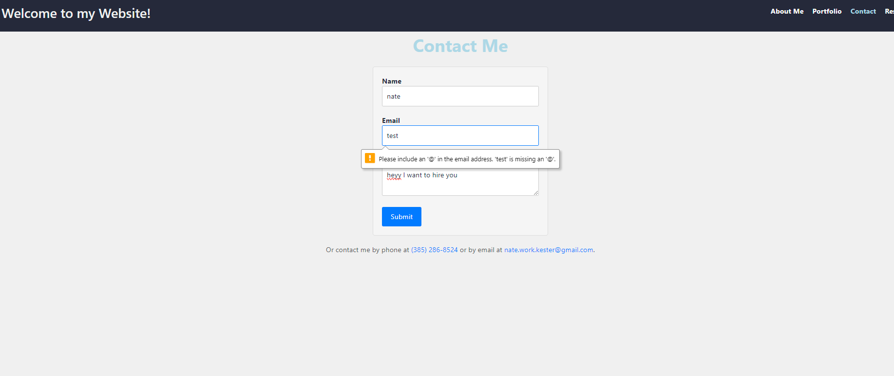

# React Portfolio
The project for week 20-- Building a portfolio using react!

## Table of Contents
 - [Installation](#installation)
 - [usage](#usage)
 - [License](#license)
 - [Features](#featues)
 - [Contribution Guidelines](#contributing)
 - [Questons/Contact](#questions)

# Description
This is a simple website to both showcase my skills, and explain to possible recuiters the extent of my learning so far.

## Installation
You will need:
1. Node downloaded onto your machine.
2. React, both initlized and installed
3. Thats it!

## Usage
Feel free to explore the different pages that explain more about me and my future plans. The about me section breifly describes the developer who created the website(me). The projects page showcases some of my best projects, with links to both the deployed URL's and the github repo's. The contact page is a way to contact me, feel free to leave me a message(not currently connected to a backend yet) or contact me by the other methods listed. Lastly explore the skills I have listed on the resume page, or download my resume with just a click!

## License
This project is liscenced under the MIT liscence.

## Features
- One-page virtual dom react frontend
- Dynamic navigation
- Overlays on project page
- Different components recycled

## Contribution Guidelines
This is a private project for instructional purposes. This webiste will update as my life does as well

### Questions
For any questions, please contact me:

GitHub: [Nate's Repo](https://github.com/imdawizard)

Email: nate.is.cool.yeah@gmail.com

## Link to deployed application:
https://nates-react-portfolio.netlify.app/ 

## Link to github repo:
https://github.com/imdawizard/react_portfolio

## Screenshots!

